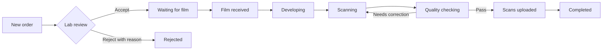
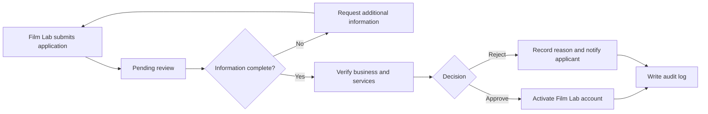
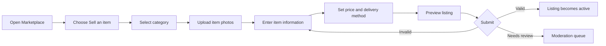
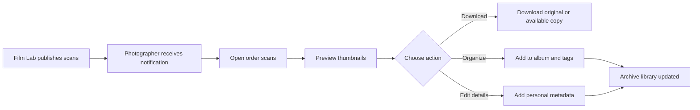
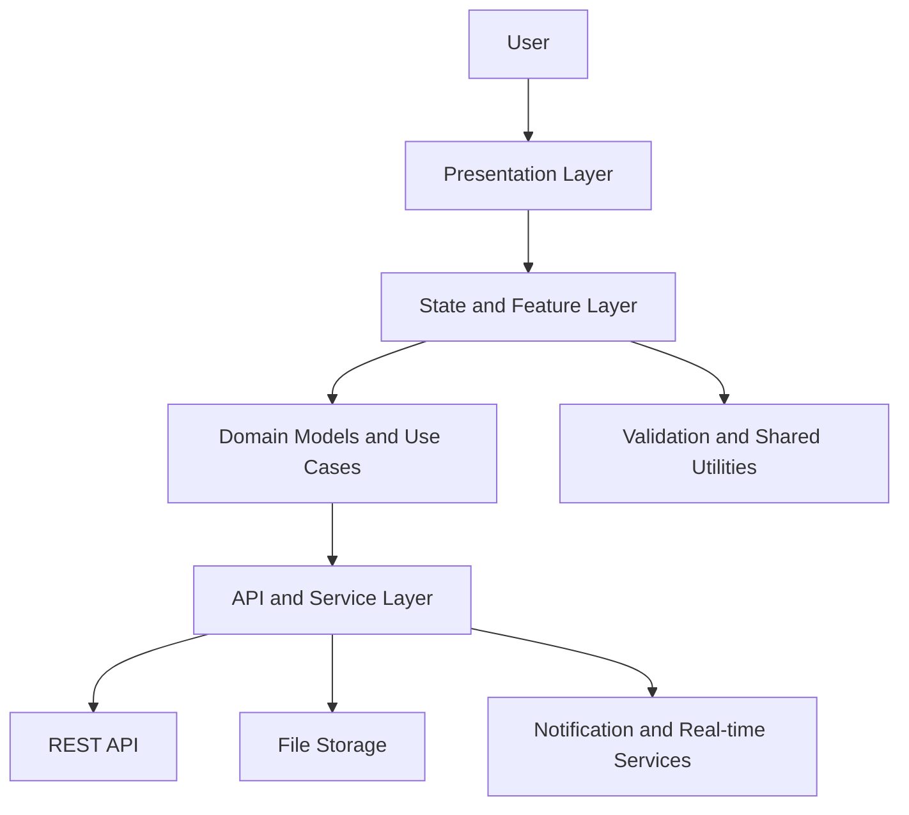

# Mobile and Web Design

**Responsible member:** Nguyen Dao Quoc Khanh

This document describes the initial structure for the mobile and web interfaces
of the AI-powered Film Photography Platform. The mobile application is intended
for photographers, while the web portals support Film Lab operators and system
administrators.

## 1. UI/UX Guidelines

The interfaces should help photographers and Film Lab staff complete common
tasks without having to learn a complicated workflow. The following rules will
be used for the first version of the product.

### Navigation and layout

- The mobile application uses a bottom navigation bar for Home, Orders,
  Archive, Marketplace, and Profile. Less frequent actions are placed inside
  the related screen instead of the main navigation.
- The Film Lab and Admin portals use a left sidebar and a page header. The
  sidebar remains consistent so that staff can quickly switch between orders,
  services, customers, reports, and settings.
- Each screen has one clear primary action, such as `Book service`, `Update
  status`, or `Upload scans`. Secondary actions use a less prominent style.
- Web pages use responsive columns. Forms become a single column on narrow
  screens, while tables can scroll horizontally when their content cannot fit.

### Visual consistency and accessibility

- Reuse the same colors, spacing, typography, icons, buttons, form fields, and
  status labels through a shared design system.
- Do not communicate status by color alone. Every status includes a text label
  such as `Waiting for pickup`, `Processing`, `Scanning`, or `Completed`.
- Text and controls must have sufficient contrast. Interactive controls should
  have clear focus, hover, pressed, and disabled states.
- Form fields use visible labels and short validation messages. Required fields
  are identified before the user submits the form.

### Feedback and error handling

- Display a loading indicator when data is being fetched or a file is being
  uploaded. Long uploads show progress and allow the user to retry.
- Empty screens explain why no data is available and provide a relevant action,
  for example `Find a Film Lab` when the photographer has no orders.
- Destructive actions, such as deleting an archive item or cancelling an order,
  require confirmation.
- Error messages use simple language, preserve valid form data, and explain the
  next action the user can take.

### Platform-specific behavior

- Flutter screens follow mobile interaction patterns and keep important actions
  within thumb reach. Notifications open the related order or scan directly.
- React/Next.js portals support keyboard navigation, searchable tables,
  pagination, filtering, and clear breadcrumbs for staff workflows.

## 2. Photographer Mobile Application

The Photographer application is developed with Flutter so that the same main
features can be provided on Android and iOS. Its purpose is to help a
photographer find a Film Lab, create a processing order, follow its progress,
and receive digital scans from one application.

### Main screens

| Screen group | Main functions |
| --- | --- |
| Authentication | Register, log in, reset password, and verify account |
| Home | View current orders, nearby Film Labs, recommendations, and notifications |
| Film Lab discovery | Search by location and filter by film format, service, price, rating, or processing time |
| Film Lab details | View services, supported film formats, price list, opening hours, reviews, and estimated completion time |
| Booking | Select service, enter roll information, choose pickup or drop-off, review cost, and confirm the order |
| Orders | View order history and follow pickup, processing, scanning, and delivery status |
| Scan delivery | Preview scan thumbnails, download files, and save images to the archive |
| Digital Film Archive | Organize scans into albums and manage tags, favorites, metadata, and privacy |
| Marketplace | Search equipment listings, view seller details, contact a seller, and follow transaction status |
| Community | View posts, share photographs, comment, save content, and report inappropriate content |
| AI Assistant | Ask questions about film stocks, exposure, camera settings, Film Labs, and processing services |
| Profile | Update personal information, saved addresses, notification settings, and security settings |

### Mobile navigation

The application uses five bottom navigation destinations: `Home`, `Orders`,
`Archive`, `Marketplace`, and `Profile`. Film Lab discovery starts from Home,
while Community and AI Assistant are available as clear shortcuts. A detail
screen is opened on top of the current destination so that the user can return
without losing search filters or entered booking information.

### Photographer booking flow

```mermaid
flowchart LR
    A[Login] --> B[Home]
    B --> C[Search Film Lab]
    C --> D[Filter and compare]
    D --> E[View Film Lab details]
    E --> F[Select service]
    F --> G[Enter film information]
    G --> H[Choose pickup or drop-off]
    H --> I[Review price]
    I --> J[Confirm order]
    J --> K[Track order status]
    K --> L[Preview and download scans]
    L --> M[Save to Digital Film Archive]
```



### Booking information

Before confirming an order, the photographer provides:

- Film format and film stock, for example 35 mm or 120 film.
- Number of rolls and preferred processing service.
- Scanning resolution and output format when scanning is selected.
- Pickup address and available time, or the selected drop-off option.
- Contact details and an optional note for the Film Lab.

The application shows the service price, pickup fee, estimated completion time,
and total amount before confirmation. Required information is validated on the
current step so the user does not lose data by returning to an earlier step.

### Order tracking

Each order displays a timeline with these basic statuses:

`Pending confirmation -> Pickup scheduled -> Received by Film Lab -> Processing -> Scanning -> Ready for delivery -> Completed`

The user receives a notification when the Film Lab confirms the order, changes
an important processing status, uploads scan files, or reports a problem. If an
order is cancelled, the timeline displays who cancelled it and the reason.

### Important interface states

- When location permission is unavailable, the user can enter a district or
  city manually to search for Film Labs.
- When there is no search result, the application keeps the selected filters
  visible and suggests removing one filter.
- When a booking request fails, the entered information is preserved and a
  retry action is displayed.
- Scan downloads show progress and can be retried if the network connection is
  interrupted.
- Private archive items are not shared with Community or Marketplace unless the
  photographer explicitly selects them.

## 3. Film Lab Web Portal

The Film Lab portal is a React/Next.js web application for lab owners and
employees. It provides a larger working area than the mobile application so
that staff can review many orders, update processing stages, and upload scan
files efficiently.

### User roles

- **Lab owner:** manages the Film Lab profile, services, prices, employees, and
  reports.
- **Lab employee:** receives assigned orders, updates processing stages, and
  uploads scan files.
- Both roles only access data that belongs to their Film Lab. Sensitive actions,
  such as changing prices or managing employees, require the owner role.

### Main pages

| Page | Main functions |
| --- | --- |
| Dashboard | Display new orders, delayed orders, daily workload, completed orders, and important notifications |
| Orders | Search and filter orders by code, customer, date, service, employee, or processing status |
| Order details | Review film information, selected services, customer notes, pickup details, price, and status history |
| Processing board | Move orders through accepted, received, developing, scanning, quality checking, and completed stages |
| Schedule | View pickup requests, expected processing dates, employee assignments, and deadlines |
| Scan delivery | Upload scan files, check file information, preview thumbnails, and release files to the customer |
| Services and pricing | Manage supported film formats, processing options, scan resolution, turnaround time, and price |
| Customers | View customer contact information, order history, feedback, and service notes |
| Reports | Summarize order quantity, revenue, popular services, completion time, and customer ratings |
| Lab settings | Update profile, address, business hours, contact channels, pickup area, and employee permissions |

### Order processing workflow



Each status update records the employee, time, and optional note. The portal
sends a notification to the photographer when the order is accepted, when the
film is received, when an important delay occurs, and when scans are available.
Invalid status jumps are disabled to protect the order history.

### Scan upload and delivery

1. The employee selects a processing order and chooses `Upload scans`.
2. The portal checks the file type, file size, and number of images before
   uploading.
3. Upload progress is shown for each file. Failed files can be retried without
   uploading successful files again.
4. The employee previews thumbnails and enters optional information such as
   resolution or scanner model.
5. After quality checking, the employee publishes the scans. The photographer
   receives a notification and can access them from the mobile application.

The release action requires confirmation because customers can see published
files immediately. Files that have not been published remain visible only to
authorized Film Lab staff.

### Interface behavior

- The order list uses pagination, search, filters, and clear status labels so
  that staff can handle a large number of orders.
- The dashboard prioritizes work that needs attention instead of showing only
  general statistics.
- Forms warn users about unsaved changes. Validation messages appear next to
  the related field and preserve valid input.
- Destructive actions require confirmation and an explanation when the action
  affects a customer order.
- The portal supports desktop and tablet layouts. Tables scroll horizontally on
  smaller screens without hiding primary order actions.

### Suggested React/Next.js components

```text
film-lab-portal/
|-- dashboard/
|-- orders/
|   |-- OrderTable
|   |-- OrderDetails
|   |-- ProcessingBoard
|   `-- StatusHistory
|-- schedule/
|-- scan-delivery/
|   |-- ScanUploader
|   |-- UploadProgress
|   `-- ScanPreview
|-- services/
|-- customers/
|-- reports/
`-- settings/
```

The components call shared service functions instead of sending requests
directly. This keeps authentication, error handling, and API response mapping
consistent across the portal.

## 4. Administration Web Portal

The Administration Portal is a React/Next.js web application used to operate
the platform and handle cases that cannot be completed automatically. It is
separated from the Film Lab Portal because administrators can view platform
data across different users and Film Labs.

### Administrator roles

- **System administrator:** manages accounts, roles, configuration, service
  categories, and platform access.
- **Moderator:** reviews community content, marketplace reports, complaints,
  reviews, and disputes.
- **Finance staff:** monitors payments, fees, refunds, and transaction records.
- **Support staff:** searches users and orders, reviews their history, and adds
  internal support notes without changing system configuration.

Each role receives only the permissions needed for its work. Important actions
such as suspending an account, approving a Film Lab, issuing a refund, or
changing a platform fee are recorded in the audit log.

### Main administration pages

| Page | Main functions |
| --- | --- |
| Dashboard | Show pending approvals, reported content, open disputes, payment warnings, user growth, and system activity |
| Users and roles | Search accounts, view status and history, assign roles, suspend access, and restore eligible accounts |
| Film Lab approval | Review business information, contact details, service capabilities, submitted documents, and approval history |
| Service categories | Manage film formats, processing services, scan options, category visibility, and common attributes |
| Fees and payments | Configure platform fees, search transactions, review failed payments, and follow refund status |
| Content moderation | Review reported community posts, comments, reviews, and marketplace listings |
| Complaints and disputes | Review evidence and communication, contact related parties, record a decision, and close the case |
| Reports | View account, order, revenue, service, marketplace, moderation, and Film Lab performance summaries |
| Audit log | Search administrative actions by actor, date, action type, and affected record |
| System settings | Manage notification templates, public configuration, feature availability, and maintenance notices |

### Film Lab approval flow



The decision screen shows the submitted information and previous review events
in one place. An administrator must enter a reason when requesting more
information or rejecting an application. The Film Lab receives a notification
after every decision.

### Moderation and dispute handling

1. The portal places a new report in the moderation queue and assigns its
   priority from the report category and number of reports.
2. A moderator reviews the reported item, related account history, and attached
   evidence.
3. The moderator can dismiss the report, hide the content temporarily, request
   more information, warn the user, or escalate the case.
4. A final decision includes an internal note and a user-facing explanation.
5. The system notifies the affected users and records the action in the audit
   log.

For payment or order disputes, the portal displays the order timeline, payment
status, Film Lab updates, delivery events, messages, and uploaded evidence.
Financial actions are available only to authorized staff.

### Safety and audit requirements

- Destructive or access-changing actions require a confirmation dialog that
  clearly names the affected account, listing, order, or Film Lab.
- Administrators cannot edit or remove audit records from the normal portal.
- Tables support search, filters, sorting, pagination, and CSV export for
  authorized reports.
- Sensitive personal and payment information is hidden when the current role
  does not need it.
- The portal displays an empty state when no work is pending and a retry action
  when administrative data cannot be loaded.
- A session timeout warning appears before an inactive administrative session
  is signed out.

### Suggested React/Next.js components

```text
admin-portal/
|-- dashboard/
|-- users-and-roles/
|-- film-lab-approval/
|   |-- ApplicationQueue
|   |-- ApplicationDetails
|   `-- ApprovalHistory
|-- payments-and-fees/
|-- moderation/
|   |-- ReportQueue
|   |-- EvidenceViewer
|   `-- DecisionForm
|-- disputes/
|-- reports/
|-- audit-log/
`-- system-settings/
```

Pages use shared table, filter, status label, confirmation, and error feedback
components. Administrative permissions are checked by both the interface and
the backend; hiding a button in the frontend is not treated as access control.

## 5. Marketplace UI

The Marketplace allows community members to discover and exchange film
photography equipment. It supports cameras, lenses, film rolls, accessories,
and other related items. The interface provides enough information for users to
evaluate an item while keeping communication and reporting inside the platform.

### Main Marketplace screens

| Screen | Main functions |
| --- | --- |
| Marketplace home | Show categories, recent listings, saved searches, recommended items, and shortcuts to sell an item |
| Search results | Search by keyword and filter by category, brand, condition, location, price range, and listing date |
| Listing details | Display photos, price, condition, description, location, seller rating, available delivery method, and report action |
| Create listing | Upload photos and enter title, category, brand, model, condition, price, location, delivery method, and description |
| Seller profile | Show seller information, rating summary, active listings, completed transactions, and joined date |
| Messages | Support buyer-seller communication linked to a specific listing |
| Saved items | Display favorite listings and notify the user when an item is updated or no longer available |
| My listings | Manage draft, active, reserved, sold, hidden, rejected, and expired listings |
| Transactions | Follow enquiry, agreement, payment, delivery, completion, cancellation, and dispute status |

### Create listing flow



The preview screen shows the listing as a buyer will see it. Required fields
are checked before submission, and uploaded photos remain available when the
user returns to edit a field. A seller can save an incomplete listing as a
draft.

### Search and transaction behavior

- Active filters are displayed above the result list and can be removed
  individually without clearing the entire search.
- Sold, reserved, expired, hidden, and removed listings have a visible text
  status and cannot start a new transaction.
- Messages display the related item summary so that users do not confuse
  conversations from different listings.
- Transaction history records important changes such as price agreement,
  cancellation, delivery confirmation, and dispute creation.
- Buyers and sellers can rate each other only after a completed transaction.

### Trust, reporting, and interface states

- A user can report a listing, message, or account and select a reason before
  submission. The report is sent to the Admin Portal for review.
- The interface warns users not to publish sensitive personal or payment
  information in the public listing description.
- Empty search results preserve the selected filters and suggest a less
  restrictive search.
- Failed image uploads show the affected image and a retry action instead of
  clearing the complete form.
- A removed listing displays a short explanation to its owner and links to the
  relevant moderation or dispute record when available.

## 6. Digital Film Archive UI

The Digital Film Archive stores the photographer's scan files after a Film Lab
publishes them. It provides a visual library for finding, organizing, and
downloading photographs without changing the original scan delivered by the
Film Lab.

### Main Archive screens

| Screen | Main functions |
| --- | --- |
| Archive library | Display a grid or list of scans grouped by order, album, film stock, or shooting date |
| Order scans | Show all files delivered for one processing order and the related Film Lab information |
| Photo viewer | Preview an image, zoom, move between photos, download the file, and view metadata |
| Albums | Create, rename, and remove albums and add or remove photographs |
| Search and filters | Search tags or notes and filter by date, favorite status, camera, lens, film stock, Film Lab, or privacy |
| Metadata editor | Add shooting date, camera, lens, location name, tags, favorite status, and personal notes |
| Downloads | Select one or more files, choose an available resolution, and follow download progress |
| Storage and privacy | View storage usage and control private or shared access for supported archive items |

### Scan delivery to Archive flow



### Archive organization and metadata

The interface separates information supplied by the Film Lab from information
entered by the photographer. Film Lab metadata can include order code, Film
Lab, processing service, scanner model, resolution, output format, and delivery
date. Photographer metadata can include camera, lens, shooting date, location
name, album, tags, favorite status, and notes.

The original delivered file is not overwritten when the photographer changes
tags, albums, or notes. Removing a photograph from an album also does not delete
the scan from the archive.

### Privacy and interface states

- New scan deliveries are private by default. Sharing requires a separate user
  action and clearly displays what will become visible.
- Download progress is shown for large files. Interrupted downloads can be
  restarted without changing archive metadata.
- A missing or unavailable file displays the order code and a contact action
  for the related Film Lab instead of showing a blank viewer.
- When the archive is empty, the screen links to Film Lab discovery and
  explains that published scan files will appear after an order is processed.
- Storage warnings identify large orders and completed downloads without
  deleting files automatically.
- Multi-select mode keeps the number of selected photographs visible and asks
  for confirmation before a delete action.

### Suggested shared components

```text
marketplace-and-archive/
|-- marketplace/
|   |-- ListingCard
|   |-- ListingFilters
|   |-- ListingForm
|   |-- SellerSummary
|   `-- TransactionTimeline
|-- archive/
|   |-- PhotoGrid
|   |-- PhotoViewer
|   |-- MetadataPanel
|   |-- AlbumSelector
|   `-- DownloadProgress
`-- shared/
    |-- SearchBar
    |-- EmptyState
    |-- StatusLabel
    `-- ReportDialog
```

## 7. Main UI Flows

### Photographer Booking Flow

`Login -> Search Film Lab -> Compare Services -> Select Service -> Enter Film Details -> Choose Pickup -> Confirm Order -> Track Status`

### Film Lab Processing Flow

`Login -> Review Incoming Order -> Confirm Order -> Update Processing Stages -> Upload Scans -> Complete Order`

### Digital Delivery Flow

`Processing Completed -> Customer Notification -> Preview Scans -> Download Files -> Save to Digital Film Archive`

## 8. Frontend Component Architecture

The Flutter application and React/Next.js portals use the same separation of
responsibilities. This keeps screen code simple and reduces duplicated business
logic between features.



### Architecture layers

| Layer | Main responsibility | Example components |
| --- | --- | --- |
| Presentation | Render data and receive user input | Screens, pages, layouts, forms, dialogs, tables |
| State and feature | Manage screen state and coordinate actions | Authentication, orders, marketplace, archive, notifications |
| Domain | Represent shared application rules and data | User, Film Lab, service, order, scan, listing |
| API and service | Communicate with backend and external services | REST client, upload/download service, real-time updates |
| Shared | Provide reusable frontend resources | Theme, validation, error mapping, routing, localization |

### Suggested feature structure

```text
frontend/
|-- features/
|   |-- authentication/
|   |-- film_labs/
|   |-- orders/
|   |-- archive/
|   `-- marketplace/
|-- shared/
|   |-- components/
|   |-- models/
|   |-- services/
|   `-- utilities/
`-- app/
    |-- navigation/
    |-- theme/
    `-- configuration/
```

### Data flow

1. A user action starts from a screen or reusable component.
2. The feature state validates the input and calls a domain use case.
3. The service layer sends the request to the backend or file storage.
4. The response is converted into a shared model and stored in feature state.
5. The presentation layer rebuilds the affected section and shows success or
   error feedback.

Authentication tokens and environment configuration are handled by the service
layer. Screens must not store secrets or call backend endpoints directly.

## 9. Frontend Sequence Diagrams

Sequence diagrams will be prepared for these main interactions:

1. Photographer creates a service order.
2. Film Lab updates the film processing status.
3. Film Lab uploads scans and the photographer downloads them.
4. Administrator reviews a reported marketplace listing.

## 10. Planned Deliverables

- Mobile and web screen list.
- UI flow diagram.
- Frontend component architecture diagram.
- Frontend sequence diagrams.
- Initial wireframes for the Photographer App, Film Lab Portal, Admin Portal,
  Marketplace, and Digital Film Archive.
- Presentation notes for the Mobile and Web section.
