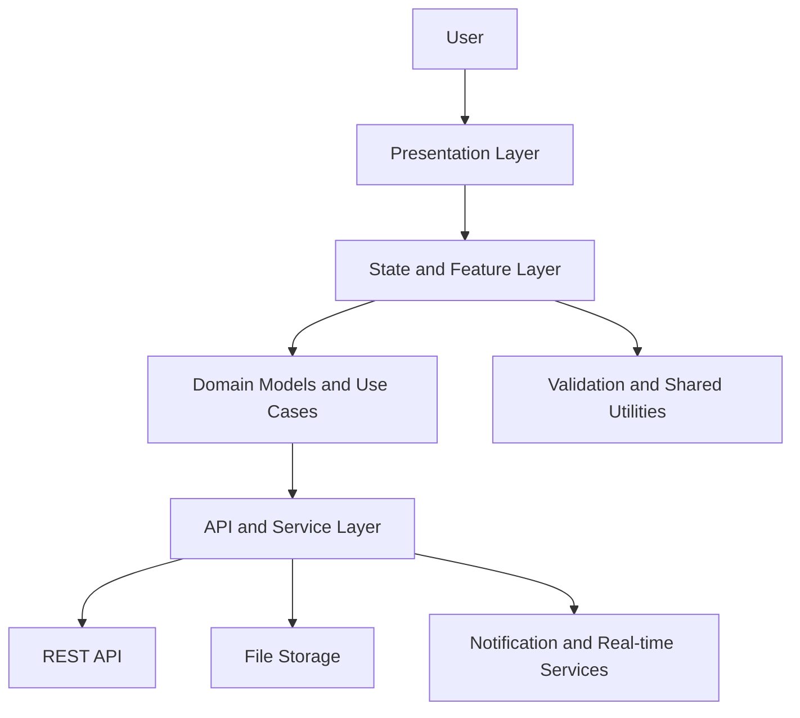

# Mobile and Web Design

**Responsible member:** Nguyen Dao Quoc Khanh

This document describes the initial structure for the mobile and web interfaces
of the AI-powered Film Photography Platform. The mobile application is intended
for photographers, while the web portals support Film Lab operators and system
administrators.

## 1. UI/UX Guidelines

The interfaces should help photographers and Film Lab staff complete common
tasks without having to learn a complicated workflow. The following rules will
be used for the first version of the product.

### Navigation and layout

- The mobile application uses a bottom navigation bar for Home, Orders,
  Archive, Marketplace, and Profile. Less frequent actions are placed inside
  the related screen instead of the main navigation.
- The Film Lab and Admin portals use a left sidebar and a page header. The
  sidebar remains consistent so that staff can quickly switch between orders,
  services, customers, reports, and settings.
- Each screen has one clear primary action, such as `Book service`, `Update
  status`, or `Upload scans`. Secondary actions use a less prominent style.
- Web pages use responsive columns. Forms become a single column on narrow
  screens, while tables can scroll horizontally when their content cannot fit.

### Visual consistency and accessibility

- Reuse the same colors, spacing, typography, icons, buttons, form fields, and
  status labels through a shared design system.
- Do not communicate status by color alone. Every status includes a text label
  such as `Waiting for pickup`, `Processing`, `Scanning`, or `Completed`.
- Text and controls must have sufficient contrast. Interactive controls should
  have clear focus, hover, pressed, and disabled states.
- Form fields use visible labels and short validation messages. Required fields
  are identified before the user submits the form.

### Feedback and error handling

- Display a loading indicator when data is being fetched or a file is being
  uploaded. Long uploads show progress and allow the user to retry.
- Empty screens explain why no data is available and provide a relevant action,
  for example `Find a Film Lab` when the photographer has no orders.
- Destructive actions, such as deleting an archive item or cancelling an order,
  require confirmation.
- Error messages use simple language, preserve valid form data, and explain the
  next action the user can take.

### Platform-specific behavior

- Flutter screens follow mobile interaction patterns and keep important actions
  within thumb reach. Notifications open the related order or scan directly.
- React/Next.js portals support keyboard navigation, searchable tables,
  pagination, filtering, and clear breadcrumbs for staff workflows.

## 2. Photographer Mobile Application

The Photographer application is developed with Flutter so that the same main
features can be provided on Android and iOS. Its purpose is to help a
photographer find a Film Lab, create a processing order, follow its progress,
and receive digital scans from one application.

### Main screens

| Screen group | Main functions |
| --- | --- |
| Authentication | Register, log in, reset password, and verify account |
| Home | View current orders, nearby Film Labs, recommendations, and notifications |
| Film Lab discovery | Search by location and filter by film format, service, price, rating, or processing time |
| Film Lab details | View services, supported film formats, price list, opening hours, reviews, and estimated completion time |
| Booking | Select service, enter roll information, choose pickup or drop-off, review cost, and confirm the order |
| Orders | View order history and follow pickup, processing, scanning, and delivery status |
| Scan delivery | Preview scan thumbnails, download files, and save images to the archive |
| Digital Film Archive | Organize scans into albums and manage tags, favorites, metadata, and privacy |
| Marketplace | Search equipment listings, view seller details, contact a seller, and follow transaction status |
| Community | View posts, share photographs, comment, save content, and report inappropriate content |
| AI Assistant | Ask questions about film stocks, exposure, camera settings, Film Labs, and processing services |
| Profile | Update personal information, saved addresses, notification settings, and security settings |

### Mobile navigation

The application uses five bottom navigation destinations: `Home`, `Orders`,
`Archive`, `Marketplace`, and `Profile`. Film Lab discovery starts from Home,
while Community and AI Assistant are available as clear shortcuts. A detail
screen is opened on top of the current destination so that the user can return
without losing search filters or entered booking information.

### Photographer booking flow

```mermaid
flowchart LR
    A[Login] --> B[Home]
    B --> C[Search Film Lab]
    C --> D[Filter and compare]
    D --> E[View Film Lab details]
    E --> F[Select service]
    F --> G[Enter film information]
    G --> H[Choose pickup or drop-off]
    H --> I[Review price]
    I --> J[Confirm order]
    J --> K[Track order status]
    K --> L[Preview and download scans]
    L --> M[Save to Digital Film Archive]
```



### Booking information

Before confirming an order, the photographer provides:

- Film format and film stock, for example 35 mm or 120 film.
- Number of rolls and preferred processing service.
- Scanning resolution and output format when scanning is selected.
- Pickup address and available time, or the selected drop-off option.
- Contact details and an optional note for the Film Lab.

The application shows the service price, pickup fee, estimated completion time,
and total amount before confirmation. Required information is validated on the
current step so the user does not lose data by returning to an earlier step.

### Order tracking

Each order displays a timeline with these basic statuses:

`Pending confirmation -> Pickup scheduled -> Received by Film Lab -> Processing -> Scanning -> Ready for delivery -> Completed`

The user receives a notification when the Film Lab confirms the order, changes
an important processing status, uploads scan files, or reports a problem. If an
order is cancelled, the timeline displays who cancelled it and the reason.

### Important interface states

- When location permission is unavailable, the user can enter a district or
  city manually to search for Film Labs.
- When there is no search result, the application keeps the selected filters
  visible and suggests removing one filter.
- When a booking request fails, the entered information is preserved and a
  retry action is displayed.
- Scan downloads show progress and can be retried if the network connection is
  interrupted.
- Private archive items are not shared with Community or Marketplace unless the
  photographer explicitly selects them.

## 3. Film Lab Web Portal

The Film Lab portal will include:

- Lab profile, supported film formats, services, and pricing management.
- Incoming order confirmation and processing schedule.
- Processing workflow and order status updates.
- Digital scan upload and customer delivery.
- Customer, revenue, and activity reports.

## 4. Administration Web Portal

The administration portal will include:

- User, role, and Film Lab approval management.
- Service category and transaction fee management.
- Payment and platform activity monitoring.
- Review, community content, complaint, and dispute moderation.
- Basic platform reports and audit information.

## 5. Marketplace UI

- Create, edit, and remove equipment listings.
- Search and filter cameras, lenses, film rolls, and accessories.
- View seller information, ratings, and item details.
- Support buyer-seller communication and transaction status tracking.
- Report suspicious listings or transaction problems.

## 6. Digital Film Archive UI

- Display scans by order, album, film stock, and shooting date.
- Preview, download, organize, tag, and favorite photographs.
- Show camera, lens, processing, and scanning metadata.
- Provide clear storage, privacy, and access states.

## 7. Main UI Flows

### Photographer Booking Flow

`Login -> Search Film Lab -> Compare Services -> Select Service -> Enter Film Details -> Choose Pickup -> Confirm Order -> Track Status`

### Film Lab Processing Flow

`Login -> Review Incoming Order -> Confirm Order -> Update Processing Stages -> Upload Scans -> Complete Order`

### Digital Delivery Flow

`Processing Completed -> Customer Notification -> Preview Scans -> Download Files -> Save to Digital Film Archive`

## 8. Frontend Component Architecture

The Flutter application and React/Next.js portals use the same separation of
responsibilities. This keeps screen code simple and reduces duplicated business
logic between features.



### Architecture layers

| Layer | Main responsibility | Example components |
| --- | --- | --- |
| Presentation | Render data and receive user input | Screens, pages, layouts, forms, dialogs, tables |
| State and feature | Manage screen state and coordinate actions | Authentication, orders, marketplace, archive, notifications |
| Domain | Represent shared application rules and data | User, Film Lab, service, order, scan, listing |
| API and service | Communicate with backend and external services | REST client, upload/download service, real-time updates |
| Shared | Provide reusable frontend resources | Theme, validation, error mapping, routing, localization |

### Suggested feature structure

```text
frontend/
|-- features/
|   |-- authentication/
|   |-- film_labs/
|   |-- orders/
|   |-- archive/
|   `-- marketplace/
|-- shared/
|   |-- components/
|   |-- models/
|   |-- services/
|   `-- utilities/
`-- app/
    |-- navigation/
    |-- theme/
    `-- configuration/
```

### Data flow

1. A user action starts from a screen or reusable component.
2. The feature state validates the input and calls a domain use case.
3. The service layer sends the request to the backend or file storage.
4. The response is converted into a shared model and stored in feature state.
5. The presentation layer rebuilds the affected section and shows success or
   error feedback.

Authentication tokens and environment configuration are handled by the service
layer. Screens must not store secrets or call backend endpoints directly.

## 9. Frontend Sequence Diagrams

Sequence diagrams will be prepared for these main interactions:

1. Photographer creates a service order.
2. Film Lab updates the film processing status.
3. Film Lab uploads scans and the photographer downloads them.
4. Administrator reviews a reported marketplace listing.

## 10. Planned Deliverables

- Mobile and web screen list.
- UI flow diagram.
- Frontend component architecture diagram.
- Frontend sequence diagrams.
- Initial wireframes for the Photographer App, Film Lab Portal, Admin Portal,
  Marketplace, and Digital Film Archive.
- Presentation notes for the Mobile and Web section.
